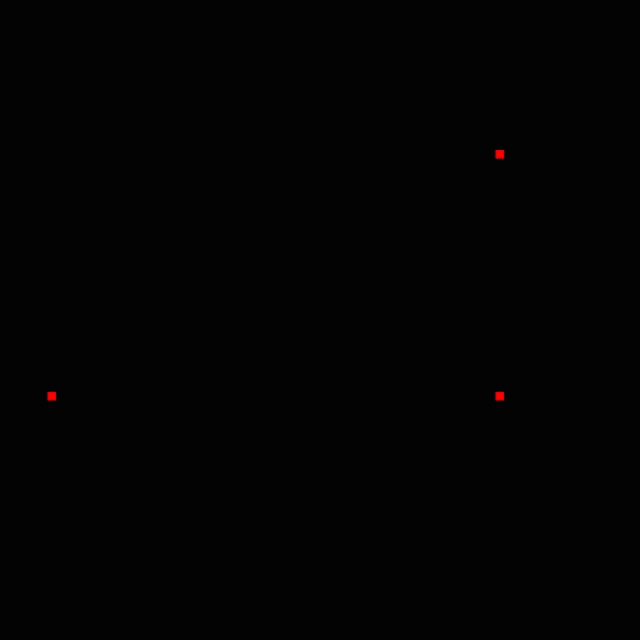
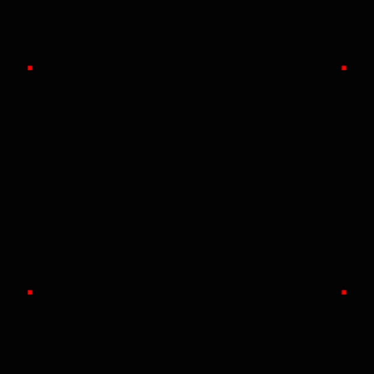

# FluidSim

## Rácsos gázautomata (Lattice Gas Automata)
A rácsos gázautomaták olyan sejtautomaták amiket folyadék áramlás szimulására használnak, a rács-Boltzman módszer elődje.

### HPP Model(Hardy, Pomeau and de Pazzis)
Az első és legegyszerűbb rácsos gázautomata model a HPP Model. A model a részecske mozgási irányait tartalmazza a rácsokban. Az algoritmus 2 lépésből áll, az áramlás és az ütközésből. Az áramlási szakasz során a részecskék a mozgási irányuk szerint a következő cellába jut. Ütközés akkor következik be ha ugyanabba a cellába ellentétes irányú részecskék érkeznek, ekkor az irányuk 90°-kal elfordul. A model diszkrét áramlási sebességei a következők:
e<sub>0</sub>=(1,0)
e<sub>1</sub>=(0,1)
e<sub>2</sub>=(-1,0)
e<sub>3</sub>=(0,-1)

Egy 500x500-as rácsot 4 áramlási sebességgel a következőképpen tudjuk ábrázolni.:


b boolean

ahol f egy három dimenziós boolean tömb, x a rács x(0-499), y a rács y(4-499) koordinátája. Az i(0-3) index a fentebb definiált sebességek indexe. Más szóval a fenti képlet megadja hogy az (x,y) helyen van-e e<sub>i</sub> irányú részecske.

Ezután az ütközési szakasz a következő képpen írhatő le.:

f<sup>'</sup>[x][y][i] = f[x][y][i] + c
<br>

, ahol a c értéke:<br>

<p>c = f[x][y][(i+1)%4]*(1-f[x][y][i])*(1-f[x][y][(i+2)4])-(1-f[x][y][(i+1)%4])*(1-f[x][y][(i+3)%4])*(f[x][y][i])*(f[x][y][(i+2)%4]) </p>
<br>


Példa kód a HPP Modelre:
```cpp
stream()
{
	for (int i = 1; i < width-1; i++) {
		for (int j = 1; j < height-1; j++) {
			for (int k = 0; k < 4; k++) {
				vector2 e = velocities[k];
				f[(i+(int)e.x)%width][(j+(int)e.y)%height][k] = fn[i][j][k];
			}
		}
	}
}
collide()
{
	for (int i = 1; i < width - 1; i++) {
		for (int j = 1; j < height - 1; j++) {
			for (int k = 0; k < 4; k++) {
				int c = f[i][j][(k + 1) % 4] * f[i][j][(k + 3) % 4] * (1 - f[i][j][k]) * (1 - f[i][j][(k + 2) % 4]) -
					(1 - f[i][j][(k + 1) % 4]) * (1 - f[i][j][(k + 3) % 4]) * f[i][j][k] * f[i][j][(k + 2) % 4];
				fn[i][j][k] = f[i][j][k] + c;
			}
		}
	}
}
```

|  |  |  |
|:--:| :--: | :--: |
| *Ellenkező irányú részecskék ütközése* | *90°-os ütközés* | *Fallal való ütközés* |

### FHP Model(Frisch, Hasslacher, and Pomeau)
Az FHP és HPP Model között a legnagyobb különbség a részecskék áramlási irányainak száma, ami az FHP esetében 6.

|  | |
| :--: | :--: |
| Három részecske ütközés az FHP Modelben | Két részecske ütközése az FHP Modelben | 
### LBM (Rács Boltzmann Módszer)
A rács Bolltzman módszernél a rács pontok eloszlási függvényeket tartalmaznak.
### LBGK Model
Az LBGK modelleket dimenzió(n) és sebesség(b) szám által csoporotsítják (DnQb).A következőkben a D2Q9 modellel foglalkozunk. Az áramlás nem változik az LGA-hoz képest, azonban az ütközési szakasz kicsit összetettebb.


Az eloszlási függvény a következő tömbbel ábrázolható.:

(R valós szám x és y a tengelyek szerinti rács pont i a sebességek száma)

Az algoritmushoz tudnunk kell az egyes rácspontok sűrűségét és a részecskék sebességét, amiket a következő tömbbökben tárolunk.:


Az ütközési szakasz a következő képpen alakul.:
<br>
ahol,
<br>
és
<br>
- A,B,C,D konstansok, amiket a rács geometriája határoz meg. Esetünkben (D2Q9 model) A = 1, B = 4, C = 4.5 és D = -1.5
- τ relaxációs idő
- 
- 

```cpp
double feq(double rho, double u, double v, int k)
{
	double cu, U2;
	cu = cx[k] * u+cy[k]*v;
	U2=u*u+v*v;
	return w[k]*rho*(1.0+3.0*cu+4.5*cu*cu-1.5*U2);
}
void collide()
{
	for(int i = 0;i<=height;i++){
		for(int j = 0;i<=width;i++){
			for(int k = 0;k<Q;k++){
				double FEQ = feq(rho[j][i],ux[j][i],uy[j][i],k);
				fpost[j][i][k] = f[j][i][k] - (f[j][i][k] - FEQ) / tau;
			}
		}
	}
}
void stream()
{
	for(int i = 0;i<=height;i++){
		for(int j = 0;i<=width;i++){
			for(int k = 0;k<Q;k++){
				int jd = j - cy[k];
				int id = i - cx[k];
				if(jd>=0 && jd<=height && id>=0 && id<=width){
					f[j][i][k]=fpost[jd][id][k];
				}
			}
		}
	}
}
void calc_vel()
{
	rho[j][i] = 0;
	for(int k = 0;k<Q;k++){
		rho[j][i] += f[j][i][k];
	}
	ux[j][i]=(f[j][i][1]+f[j][i][5]+f[j][i][8]-f[j][i][3]-
	f[j][i][6]-f[j][i][7])/rho[j][i];
	uy[j][i]=(f[j][i][5]+f[j][i][6]+f[j][i][2]-f[j][i][7]-
	f[j][i][8]-f[j][i][4])/rho[j][i]; 

}
```
Az áramlás ábrázolásakor a sebességek abszolút értékét rajzoljuk ki.sqrt(ux*ux+uy*uy)

### CUDA program
Az algoritmus optamilázálása érdekében a lépéseket párhuzamosíthajuk, azzaz a rács pontjait egy lépésben egyidejűleig módosíthatjuk. Ennek több módja van, mi az NVIDIA által szolgáltatott CUDA(Compute Unified Device Architecture)[3] szoftvert használjuk.
A programnak megadjuk az elvégezni kívánt függvényt, illetve a párhuzamos szálak számát. Általában több szálat kell használnunk mint amenyyi a grafikus vezérlőnk lehetővé tesz, ezért a CUDA szoftver a szálakat blokkokba rendezi és a blokkokat egymás után dolgozza fel.

GPU-n elvégezhető függvény létrehozása:
```cpp
__global__
void fgv(parameterk...)
{
	//fn definition
}
```

A függvény meghívása:
```cpp
fuggveny<<<blocks, threads>>>(parameterk);
```
A feldolgozni kívánt adatokat átkell másolnunk a GPU-ra, az algoritmus során feldolgozott adatok mérete miatt ez a művelet akár több időt is igénybe vehet, mint maga az algoritmus, ezért megkell fontolnunk hogy az adatokat milyen gyakorisággal és milyen módon szinkronizáljuk.

Adat tömb létrehozása a GPU-n.
```cpp
int* data;
cudaMalloc(&data, size*sizeof(int));
```
Adat tömb szinkronizálása a GPU és CPU között.
```cpp
int* localdata;
cudaMemcpy(localdata, data, size*sizeof(int), cudaMemcpyHostToDevice); //copy local data to GPU
//Do some calculation on data
cudaMemcpy(data, localdata, size*sizeof(int), cudaMemcpyDeviceToHost); //copy results to host
```

### LBGK CUDA implementáció
Az ütközési szakasz:
```cpp
__global__
void collideKernel(double* f, double* fpost, double* ux, double* uy, double* rho, int* cx, int* cy, double* w, int Q, double tau, int width, int height, double deltat, double deltax)
{
	//calculate index
	int threadsPerBlock = blockDim.x * blockDim.y;
	int threadNumInBlock = threadIdx.x + blockDim.x * threadIdx.y;
	int blockNumInGrid = blockIdx.x + gridDim.x * blockIdx.y;
	int i = blockNumInGrid * threadsPerBlock + threadNumInBlock;

	for (int k = 0; k < Q; k++) {
		double FEQ = feq(rho[i], ux[i], uy[i], k, cx, cy, w, deltat, deltax);
		fpost[i * Q + k] = f[i * Q + k] - (f[i * Q + k] - FEQ) / tau;
	}
}
```

Áramlási szakasz:
```cpp
__global__
void streamKernel(double* f, double* f_post, bool* solid, int width, int height, int* cx, int* cy, int* rc, double* w, double* rho, double* uwx, double* uwy, int Q)
{
	int threadsPerBlock = blockDim.x * blockDim.y;

	int threadNumInBlock = threadIdx.x + blockDim.x * threadIdx.y;

	int blockNumInGrid = blockIdx.x + gridDim.x * blockIdx.y;

	int l = blockNumInGrid * threadsPerBlock + threadNumInBlock;
	int jd, id;

	int i = l % width;
	int j = (int)(l / width);

	for (int k = 0; k < Q; k++) {
		jd = j - cy[k];
		id = i - cx[k];
		if (jd >= 0 && jd <= height - 1 && id >= 0 && id <= width - 1) {
			if (!solid[jd * width + id]) {
				f[(j * width + i) * Q + k] = f_post[(jd * width + id) * Q + k];;
			}
			else {
				f[l * Q + k] = f_post[(jd * width + id) * Q + rc[k]] + 6 * w[k] * rho[l] *
					(cx[k] * uwx[jd * width + id] + cy[k] * uwy[jd * width + id]);
			}
		}
	}
}
```

### Reynolds szám


- ρ a folyadék sűrűsége
- u az áramlási sebesség
- L a jellemző hosszméret
- μ a dinamikai viszkozitás

# References
[1]. https://en.wikipedia.org/wiki/Lattice_gas_automaton <br>
[2]. Lattice Boltzmann Method and Its Applications in Engineering(Zhaoli Guo, Chang Shu)<br>
[3]. https://developer.nvidia.com <br>
[4]. https://www.qt.io
