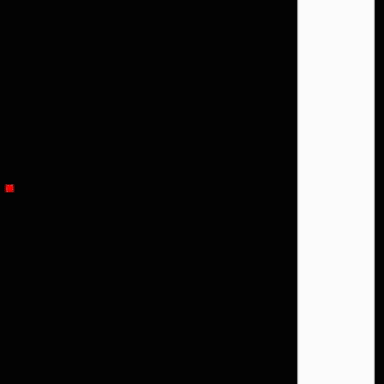

# FluidSim

## Rácsos gázautomata (Lattice Gas Automata)
A rácsos gázautomaták olyan sejtautomaták amiket folyadék áramlás szimulására használnak, a rács-Boltzman módszer elődje.

### HPP Model(Hardy, Pomeau and de Pazzis)
Az első és legegyszerűbb rácsos gázautomata model a HPP Model. A model a részecske mozgási irányait tartalmazza a rácsokban. Az algoritmus 2 lépésből áll, az áramlás és az ütközésből. Az áramlási szakasz során a részecskék a mozgási irányuk szerint a következő cellába jut. Ütközés akkor következik be ha ugyanabba a cellába ellentétes irányú részecskék érkeznek, ekkor az irányuk 90°-kal elfordul. A model diszkrét áramlási sebességei a következők: e0=(1,0)

|  |  |  |
|:--:| :--: | :--: |
| *Ellenkező irányú részecskék ütközése* | *90°-os ütközés* | *Fallal való ütközés* |

### FHP Model(Frisch, Hasslacher, and Pomeau)
Az FHP és HPP Model között a legnagyobb különbség a részecskék áramlási irányainak száma, ami az FHP esetében 6.

|  | <img src="images/fhpcollision.gif" width="300" height="300" |
| :--: | :--: |
| Három részecske ütközés az FHP Modelben | Két részecske ütközése az FHP Modelben | 

# References
[1]. https://en.wikipedia.org/wiki/Lattice_gas_automaton
